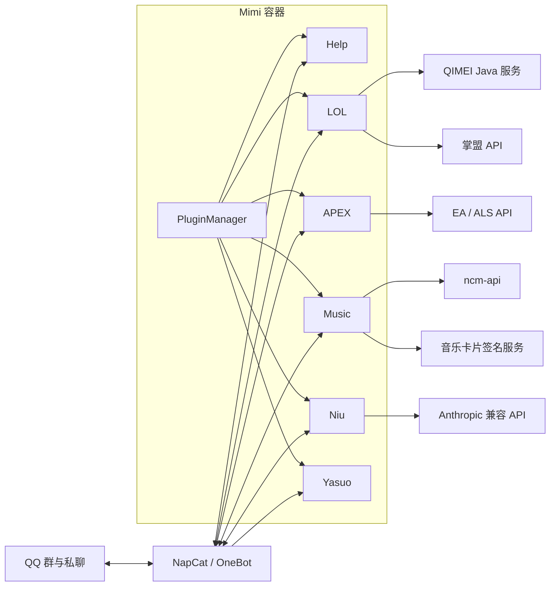

# Mimi Architecture

本文件是 Mimi 架构现状的唯一描述来源，回答“系统长什么样、组件如何交互、状态归谁”。
实现约束和验证门槛见 [`AGENTS.md`](AGENTS.md)，特性形成过程见
[`docs/feature/`](docs/feature/README.md)。本文只描述当前分支，不记录临时方案。

## 鸟瞰

Mimi 是基于 NapCat/OneBot 的插件化 QQ 机器人。仓库采用单仓库、多进程结构：

- Docker Compose 提供 NapCat、网易云 API、QIMEI 和 Mimi 容器。
- Mimi 根进程扫描 `plugins/*`，校验命令清单并启动插件子进程。
- 每个插件拥有独立 Python 环境、NapCat WebSocket、业务代码和运行数据。
- 插件之间不直接导入；共享的是环境变量、NapCat 服务和明确的 HTTP 服务。



## 运行视图

| 运行单元 | 职责 | 状态 |
| --- | --- | --- |
| `napcat` | QQ 登录、OneBot 事件与消息发送 | `data/napcat/` |
| `ncm-api` | 网易云搜索、登录和账户接口 | 外部服务状态 |
| `qimei` | 通过 Unidbg 与原生库注册 QIMEI36 | `data/qimei/` 仅缓存 APK |
| `mimi` | 根进程与全部插件子进程 | 插件数据卷 |

`mimi/main.py` 创建 `PluginManager`。管理器扫描 `plugins/` 的直接子目录，读取
`commands.toml` 并做全局、大小写不敏感的命令去重，然后在每个插件目录执行
`uv run main.py`。插件 stdout/stderr 由独立线程转发到根日志。

插件自行建立 NapCat WebSocket 并处理断线重连。这个设计用额外连接换取依赖与故障隔离；
当前管理器不会主动拉起已经退出的插件子进程，容器级异常由 Compose 重启策略处理。

## 源码视图

```text
mimi/
  main.py                 # composition root
  plugin.py               # 插件发现、命令校验、子进程管理
  client.py               # 根 NapCat 客户端
plugins/
  help/                   # 命令清单聚合与帮助海报
  lol/                    # 掌盟登录、战绩、详情与海报
  apex/                   # EA 战绩、绑定与地图轮换
  music/                  # 网易云搜索、登录与音乐卡片
  niu/                    # 群聊 AI
  yasuo/                  # 群消息归档与查询 API
qimei/
  src/main/java/qimei/    # QIMEI HTTP、APK 校验、Unidbg 调用
```

复杂插件采用以下依赖方向：

```text
main / config
    -> dispatcher
        -> feature handlers
            -> HTTP services / auth
            -> dataclass domain models
            -> Tortoise persistence models
            -> poster context
                -> Jinja2 template
                -> asset cache
                -> pytakumi PNG
```

入口负责装配与生命周期，dispatcher 只匹配命令，feature 编排用例，服务层隔离外部协议，
模型层表达数据，渲染层只消费稳定上下文。早期插件尚未完全统一，但新增代码遵循该方向。

## 状态所有权

| 状态 | 所有者 | 存储 |
| --- | --- | --- |
| QQ 登录与 NapCat 配置 | NapCat | `data/napcat/` |
| APEX 用户绑定与资产 | APEX 插件 | `data/mini/plugins/apex/data/` |
| LOL 端游/手游独立用户绑定、唯一共享会话、设备 profile、QIMEI36 | LOL 插件 | `data/mini/plugins/lol/data/` |
| 群消息与下载图片 | Yasuo 插件 | `data/mini/plugins/yasuo/data/` |
| QIMEI 所需固定 APK | QIMEI 服务 | `data/qimei/` |
| 网易云 Cookie | Music 插件 | 配置的数据文件 |

运行数据不属于源码，不进入 Git 或 Docker 构建上下文。QIMEI 服务不拥有设备身份；
LOL 插件以 profile digest 校验 QIMEI36 缓存，缓存未命中时才调用服务。

## LOL 核心链路

管理员通过 QQ OAuth 建立唯一共享掌盟会话。普通用户绑定 Riot ID、手游角色名或直接
输入昵称，插件先按游戏类型搜索玩家，再查询战绩：

```text
昵称
  -> /go/customize_search/search_type_keyword
  -> scene + uuid + area_id
  -> /go/battle_info/get_battle_list
  -> 能力信息 + 各局详情
  -> 中文战绩海报
```

手游链路使用 `gameId=lgame` 和搜索结果的 `lgameIntent`，再调用
`/go/lgame_battle_info/battle_list`、`overview` 和 `detail_v2`。端游与手游共享登录态，
但绑定表和进程内最近查询状态彼此独立。

掌盟请求固定使用 `lolapp/12.8.1 (Android)` User-Agent。模式以 `game_queue_id`
判断：`450` 为极地大乱斗，`3270` 为海克斯大乱斗。掌盟未提供的隐藏分/MMR 不估算。

登录时，LOL 插件把设备原生配置发送给 QIMEI 服务。QIMEI 服务串行运行 ARM64
`libqimei.so`，返回 QIMEI36；插件将其作为 `mcode` 完成掌盟登录并持久化票据。

## 架构不变量

1. 业务功能留在 `plugins/<name>/`，根 `mimi/` 只做进程编排和基础连接。
2. 插件之间不直接依赖代码，通过外部服务或明确契约协作。
3. 数据获取、领域模型与 HTML 渲染分离。
4. `commands.toml` 的真实触发词全仓库唯一。
5. LOL 查询必须先搜索取得目标身份，再调用战绩接口。
6. QIMEI 服务保持无设备状态，并保留在仓库根目录。
7. Cookie、Token、OAuth 回调、设备标识和数据库不进入日志、文档或 Git。
8. `data/` 与插件数据目录不进入 Docker 构建上下文。
