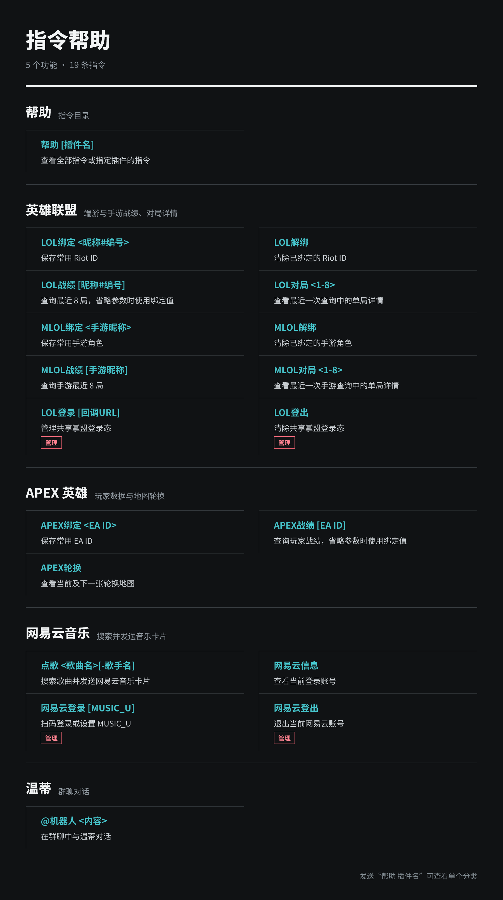
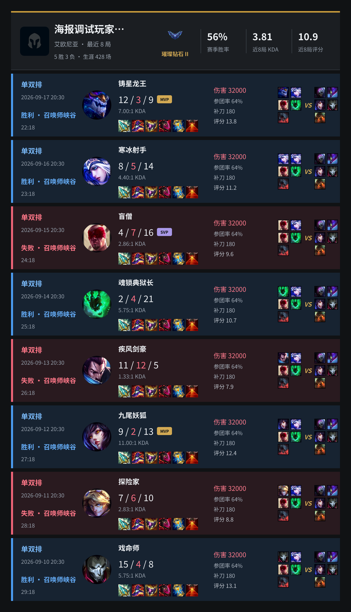
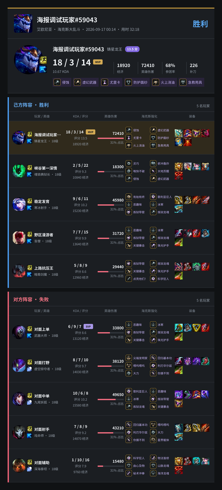
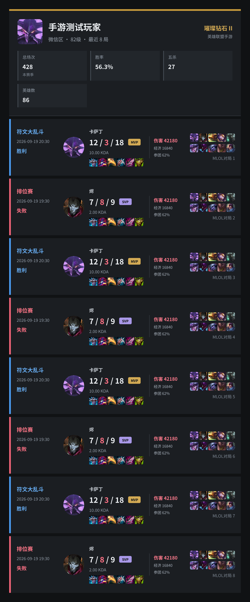
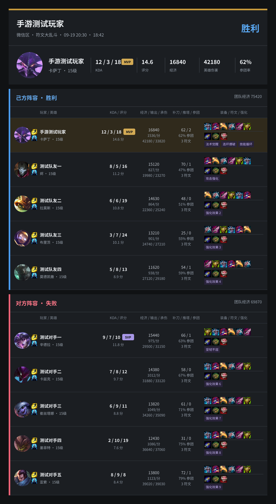
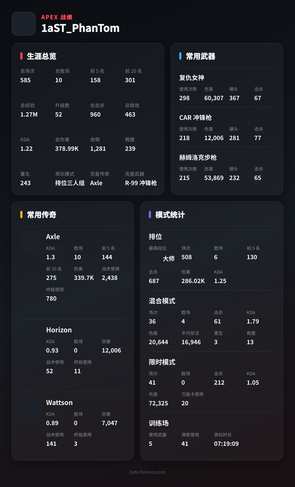
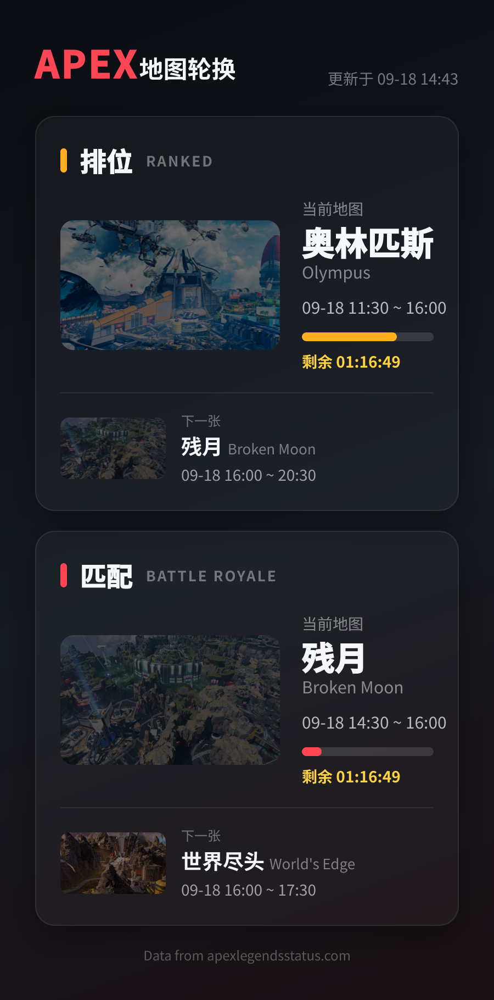
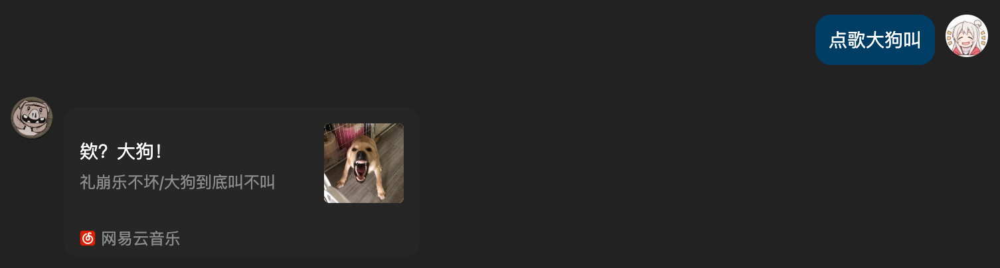

# Mimi

  

基于 NapCat / OneBot 的插件化 QQ 机器人。Mimi 把游戏战绩、音乐、群聊 AI、帮助目录和
消息归档拆成独立插件进程，让一个 QQ 账号同时承载多种群聊能力。

## 图片帮助

发送 `帮助` 即可查看所有功能，发送 `帮助 <插件名>` 可以只查看一个分类。帮助插件会
自动读取各插件的 `commands.toml` 生成中文指令目录。

  

## 英雄联盟

通过 Riot ID 或手游角色名查询掌盟公开数据。普通用户不需要登录掌盟，管理员维护一个
共享登录态；端游与手游使用独立绑定和最近查询状态。

<table>
  <tr>
    <td width="50%" valign="top">
      
    </td>
    <td width="50%" valign="top">
      
    </td>
  </tr>
  <tr>
    <td align="center"><b>端游最近战绩</b> 段位、胜率、KDA、评分、装备、伤害与双方阵容</td>
    <td align="center"><b>端游单局详情</b> 十人数据、召唤师技能、装备与海克斯强化</td>
  </tr>
</table>

<table>
  <tr>
    <td width="50%" valign="top">
      
    </td>
    <td width="50%" valign="top">
      
    </td>
  </tr>
  <tr>
    <td align="center"><b>手游最近战绩</b> 段位、荣誉、装备、经济、伤害、参团率与双方阵容</td>
    <td align="center"><b>手游单局详情</b> 十人经济、输出、承伤、参团、装备、符文与强化</td>
  </tr>
</table>

- `LOL绑定 <昵称#编号>`：保存常用 Riot ID
- `LOL战绩 [昵称#编号]`：查看最近 8 局
- `LOL对局 <1-8>`：展开最近一次查询中的单局详情
- `MLOL绑定 <手游昵称>`：保存常用手游角色
- `MLOL解绑`：清除已绑定的手游角色
- `MLOL战绩 [手游昵称]`：查看手游最近 8 局
- `MLOL对局 <1-8>`：展开最近一次手游查询中的单局详情

## APEX 英雄

绑定或直接输入 EA ID，查看玩家生涯、常用武器、常用传奇和各模式统计；地图轮换会同时
展示当前地图、剩余时间和下一张地图。

<table>
  <tr>
    <td width="58%" valign="top">
      
    </td>
    <td width="42%" valign="top">
      
    </td>
  </tr>
  <tr>
    <td align="center"><b>玩家战绩</b> 生涯、武器、传奇与模式统计</td>
    <td align="center"><b>地图轮换</b> 排位与匹配地图时间线</td>
  </tr>
</table>

- `APEX绑定 <EA ID>`：保存常用玩家
- `APEX战绩 [EA ID]`：生成玩家数据海报
- `APEX轮换`：查看当前及下一张地图

## 网易云音乐

发送 `点歌 <歌曲名>[-歌手名]` 搜索歌曲，Mimi 会直接回复可播放的网易云音乐卡片。
管理员可以通过二维码建立共享登录态，群成员无需分别登录。

  

## 更多能力

| 插件 | 使用方式 | 功能 |
| --- | --- | --- |
| 温蒂 | `@机器人 <内容>` | 在群聊中提及机器人进行 AI 对话 |
| Yasuo | 自动归档 | 保存群消息和图片，并提供分页查询 HTTP API |

## 文档入口

部署、开发和排障指引统一维护在 `docs/`，根 README 只介绍产品能力。

| 主题 | 文档 |
| --- | --- |
| 部署、配置、数据卷与回滚 | [部署规范](docs/spec/deploy-spec.md) |
| 本地环境、运行、测试与排障 | [开发指南](docs/develop-guide/README.md) |
| 设计与开发约束 | [工程规范](docs/spec/design-spec.md) |
| 系统组件与数据流 | [系统架构](ARCHITECTURE.md) |
| 功能设计与演进 | [特性档案](docs/feature/README.md) |
| 插件完整命令 | [`plugins/<name>/README.md`](plugins/lol/README.md) |
